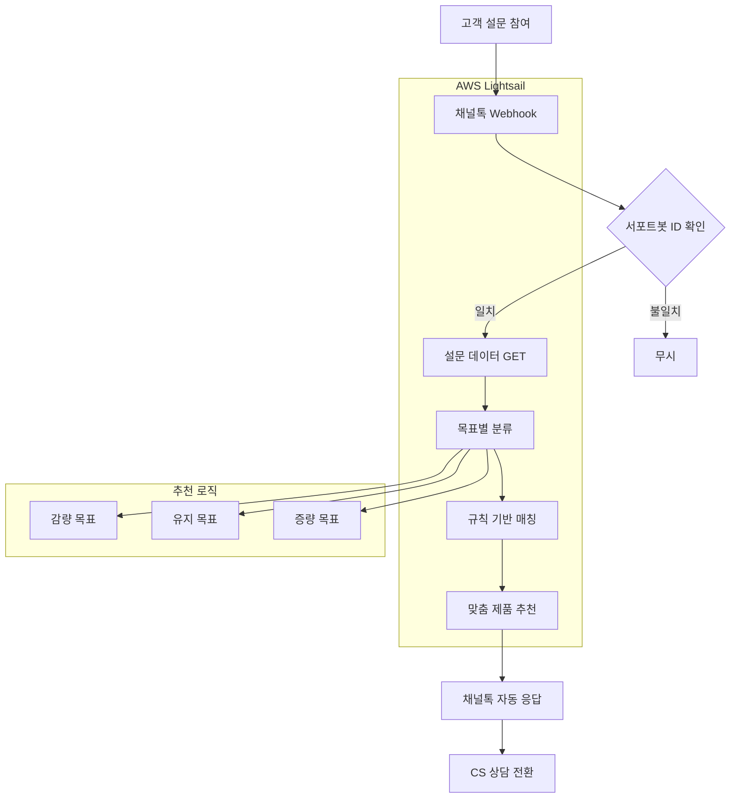

# 헬스케어 큐레이션 자동화 서비스

> **개인 맞춤형 건강관리 제품 추천 자동화를 통한 상담 전환율 혁신 프로젝트**

## 주요성과

| 지표 | 달성값 | 설명 |
|------|--------|------|
| **상담 전환율** | 8.5배 증가 | 2% → 19% 달성 |
| **일일 처리량** | 8-15건 | 평균 큐레이션 서비스 제공 |
| **시스템 가동률** | 99.9% | 24시간 무중단 서비스 |
| **응답 시간** | <= 1초 | 설문 완료 즉시 추천 제공 |

## 문제 해결

### 핵심 해결 문제

**문제**: 기존 "사이트 확인 → 직접 문의" 방식의 낮은 상담 전환율 (2%)  
**해결**: 설문조사 기반 맞춤형 제품 추천 → 자연스러운 상담 유도 시스템 구축

## 시스템 아키텍처

### 핵심 컴포넌트

- **Webhook 처리 서버**: Flask 기반 실시간 이벤트 수신
- **이벤트 필터링**: 큐레이션 전용 서포트봇 ID 매칭
- **추천 엔진**: 목표 기반 규칙 매칭 알고리즘
- **자동 응답**: 채널톡 API 연동 즉시 추천 전송

## 문제 해결

### 일반적 문제

**문제**: 모든 서포트봇에 큐레이션 로직 반응  
**해결**: Webhook 이벤트 필터링으로 큐레이션 전용 봇만 처리

**문제**: 복잡한 개인화 알고리즘 구현의 어려움  
**해결**: 목표 기반 단순 규칙 매칭으로 실용성 확보

**문제**: 24시간 서비스 안정성 요구  
**해결**: AWS Lightsail 배포로 99.9% 가동률 달성

### 성능 최적화 방법

- **응답 속도 개선**: Webhook 기반 실시간 처리로 지연 없음
- **비용 효율성**: AWS Lightsail 최소 스펙으로 EC2 대비 70% 비용 절약
- **데이터 활용**: 채널톡 DB 활용으로 별도 저장소 구축 비용 제거
- **이벤트 최적화**: ID 필터링으로 불필요한 처리 99% 감소
